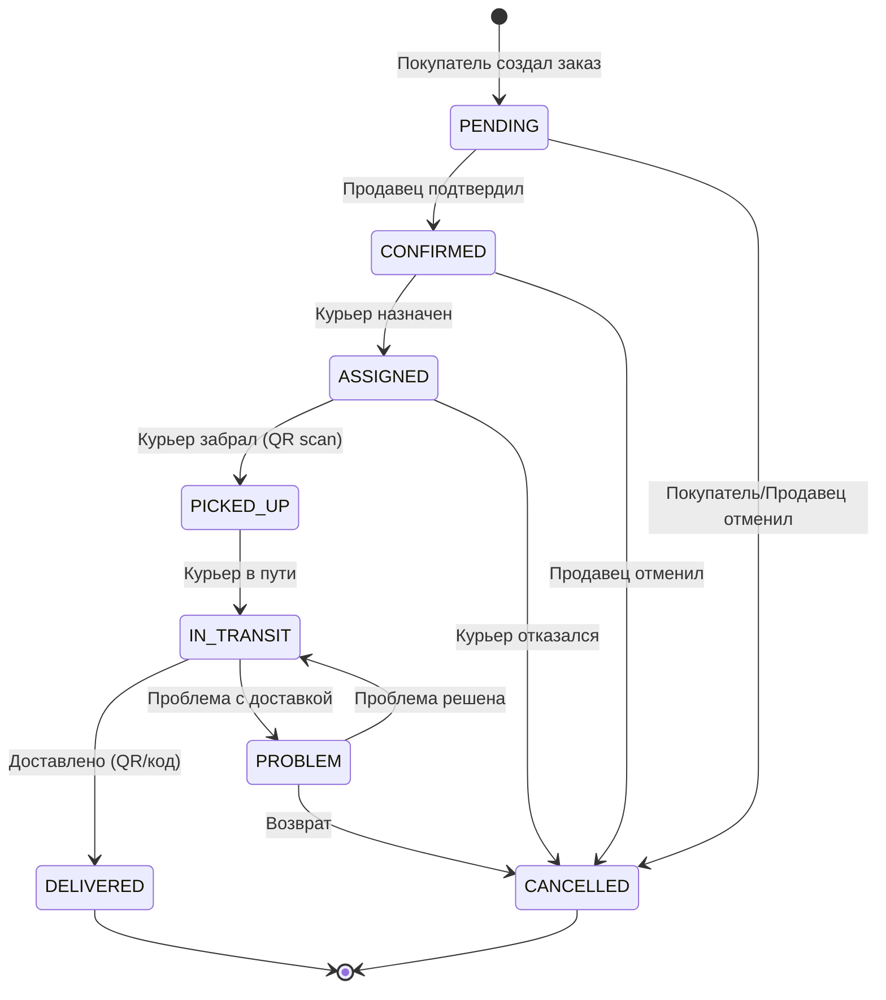
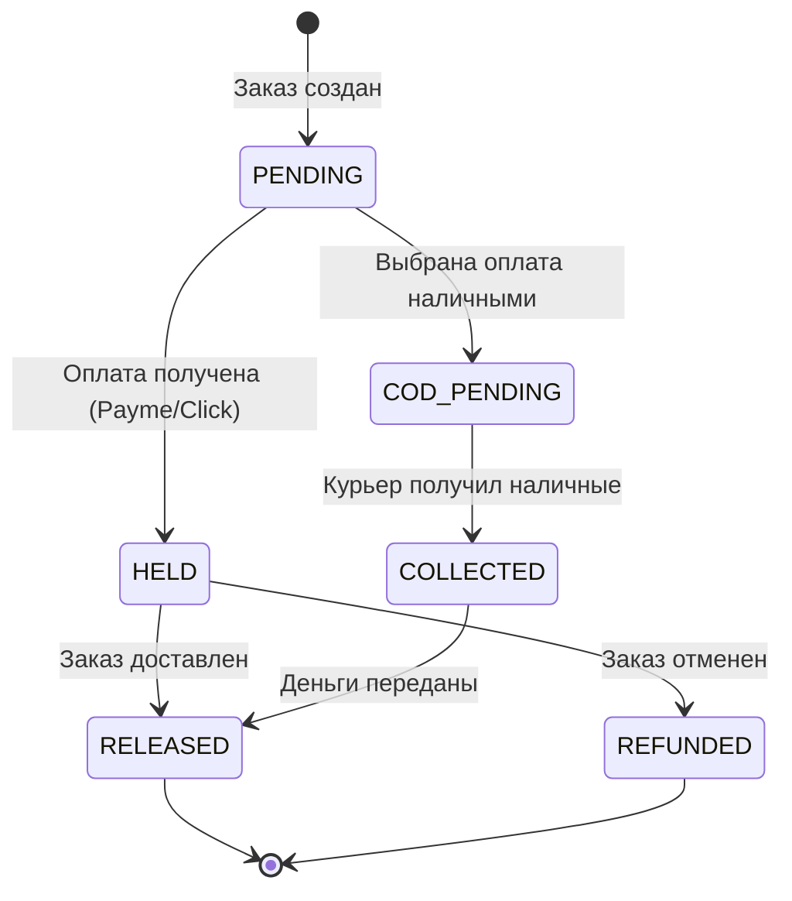
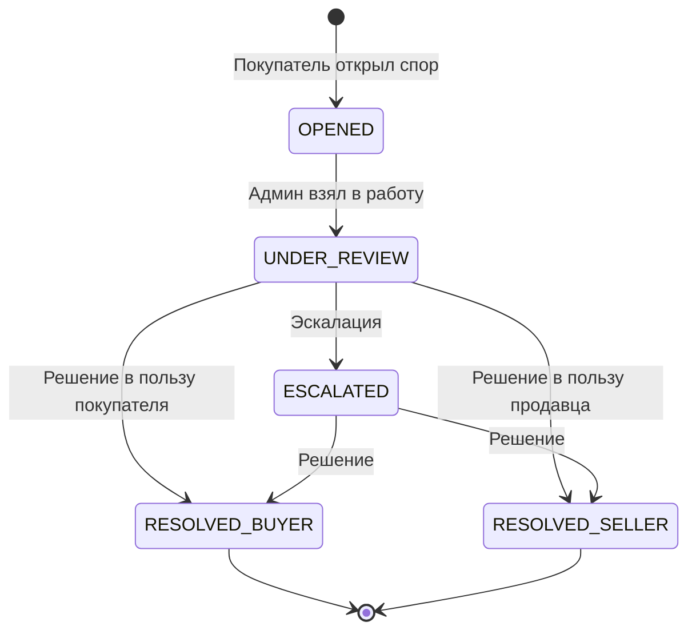

# GoGoMarket.uz - Логика функционала

**Дата:** 4 января 2026  
**Версия:** 1.0

---

## 1. Архитектура системы

```
┌─────────────────────────────────────────────────────────────────┐
│                        КЛИЕНТЫ                                   │
├─────────────────┬─────────────────┬─────────────────────────────┤
│  Flutter App    │    Web App      │      Admin Panel            │
│  (iOS/Android)  │    (React)      │      (React)                │
└────────┬────────┴────────┬────────┴────────────┬────────────────┘
         │                 │                      │
         └─────────────────┼──────────────────────┘
                           │
                    ┌──────▼──────┐
                    │   API GW    │
                    │  (Express)  │
                    └──────┬──────┘
                           │
         ┌─────────────────┼─────────────────┐
         │                 │                 │
    ┌────▼────┐      ┌─────▼─────┐     ┌─────▼─────┐
    │ Auth    │      │  Orders   │     │  Media    │
    │ Service │      │  Service  │     │  Service  │
    └────┬────┘      └─────┬─────┘     └─────┬─────┘
         │                 │                 │
         └─────────────────┼─────────────────┘
                           │
                    ┌──────▼──────┐
                    │ PostgreSQL  │
                    └─────────────┘
```

---

## 2. Модели данных

### 2.1 User (Пользователь)
```typescript
interface User {
  id: UUID
  phone: string           // +998XXXXXXXXX
  email?: string
  password: string        // bcrypt hash
  role: 'buyer' | 'seller' | 'courier' | 'admin'
  firstName?: string
  lastName?: string
  avatar?: string
  isVerified: boolean     // OTP подтвержден
  isActive: boolean       // Не заблокирован
  kycStatus?: 'pending' | 'approved' | 'rejected'  // Для seller/courier
  kycDocuments?: string[] // URLs документов
  createdAt: Date
  updatedAt: Date
}
```

### 2.2 Product (Товар)
```typescript
interface Product {
  id: UUID
  sellerId: UUID
  title: string
  description?: string
  price: number           // В UZS
  originalPrice?: number  // Старая цена (для скидок)
  images: string[]
  category?: string
  stock: number
  isActive: boolean
  rating: number          // 0-5
  reviewCount: number
  variants?: ProductVariant[]
  createdAt: Date
  updatedAt: Date
}

interface ProductVariant {
  id: UUID
  productId: UUID
  name: string            // "Размер", "Цвет"
  value: string           // "XL", "Красный"
  priceModifier: number   // +/- к базовой цене
  stock: number
}
```

### 2.3 Video (Видео/Рилс)
```typescript
interface Video {
  id: UUID
  sellerId: UUID
  productId?: UUID
  url: string
  thumbnailUrl?: string
  title?: string
  description?: string
  duration: number        // В секундах
  viewCount: number
  likeCount: number
  isActive: boolean
  moderationStatus: 'pending' | 'approved' | 'rejected'
  createdAt: Date
}
```

### 2.4 Order (Заказ)
```typescript
interface Order {
  id: UUID
  orderNumber: string     // GGM-XXXXXX
  buyerId: UUID
  sellerId: UUID
  courierId?: UUID
  productId: UUID
  videoId?: UUID          // Откуда купили
  quantity: number
  unitPrice: number
  totalAmount: number     // unitPrice * quantity + courierFee
  courierFee: number
  platformCommission: number
  sellerAmount: number    // totalAmount - platformCommission - courierFee
  currency: 'UZS'
  status: OrderStatus
  paymentMethod: 'cod' | 'payme' | 'click'
  paymentStatus: PaymentStatus
  shippingAddress: string
  shippingCity: string
  shippingPhone: string
  buyerNote?: string
  sellerQrCode: string    // QR для передачи курьеру
  courierQrCode?: string  // QR для доставки
  deliveryCode?: string   // 4-значный код
  pickedUpAt?: Date
  deliveredAt?: Date
  cancelledAt?: Date
  cancelReason?: string
  createdAt: Date
  updatedAt: Date
}
```

### 2.5 Transaction (Транзакция)
```typescript
interface Transaction {
  id: UUID
  orderId: UUID
  userId?: UUID
  type: TransactionType
  amount: number
  currency: 'UZS'
  status: PaymentStatus  // PENDING → HELD → COMPLETED / REVERSED
  description: string
  externalId?: string     // ID в Payme/Click
  createdAt: Date
}

enum TransactionType {
  PAYMENT = 'payment',              // Оплата от покупателя
  REFUND = 'refund',                // Возврат покупателю
  SELLER_PAYOUT = 'seller_payout',  // Выплата продавцу
  COURIER_PAYOUT = 'courier_payout', // Выплата курьеру
  PLATFORM_COMMISSION = 'platform_commission', // Комиссия платформы
  COMMISSION_REVERSAL = 'commission_reversal'  // Реверс комиссии при отмене
}

enum PaymentStatus {
  PENDING = 'pending',      // Ожидает оплаты
  HELD = 'held',            // Удержано (escrow)
  COMPLETED = 'completed',  // Завершено
  REFUNDED = 'refunded',    // Возвращено
  REVERSED = 'reversed'     // Отменено (реверс)
}
```

---

## 3. State Machines (Диаграммы состояний)

### 3.1 Order Lifecycle



**Переходы состояний:**

| Из состояния | В состояние | Кто может | Условия |
|--------------|-------------|-----------|---------|
| PENDING | CONFIRMED | Seller | - |
| PENDING | CANCELLED | Buyer, Seller, Admin | До подтверждения |
| CONFIRMED | ASSIGNED | Seller, Admin, System | Есть курьер |
| ASSIGNED | PICKED_UP | Courier | QR-код продавца валиден |
| PICKED_UP | IN_TRANSIT | Courier | Автоматически |
| IN_TRANSIT | DELIVERED | Courier | QR-код или код доставки |
| * | CANCELLED | Admin | Любое время |

### 3.2 Payment Flow (Escrow)



**Escrow логика (двухфазная модель комиссий):**

1. **При создании/оплате заказа:**
   - Создается `PAYMENT` транзакция (PENDING → HELD при успешной оплате)
   - Создается `PLATFORM_COMMISSION` транзакция со статусом `HELD`
   - Комиссия сразу видна в отчетах как "начисленная"

2. **При подтверждении доставки (QR/код):**
   - `PLATFORM_COMMISSION` меняет статус на `COMPLETED`
   - Создается `SELLER_PAYOUT` (COMPLETED)
   - Создается `COURIER_PAYOUT` (COMPLETED)
   - Распределение:
     - Продавец: totalAmount - platformCommission - courierFee
     - Курьер: courierFee
     - Платформа: platformCommission (5%)

3. **При отмене заказа:**
   - Создается `REFUND` для покупателя
   - Создается `COMMISSION_REVERSAL` (реверс комиссии)
   - Net Profit корректно отражает отмену

**Преимущества двухфазной модели:**
- Net Profit платформы виден в transactions на каждую продажу
- Корректная отчетность при отменах (реверсы)
- Прозрачность для бухгалтерии

### 3.3 QR Chain (Цепочка подтверждений)

```
┌──────────┐    QR1     ┌──────────┐    QR2     ┌──────────┐
│ ПРОДАВЕЦ │ ─────────► │  КУРЬЕР  │ ─────────► │ПОКУПАТЕЛЬ│
└──────────┘            └──────────┘            └──────────┘
     │                       │                       │
     │ Генерирует QR1        │ Сканирует QR1         │ Вводит код
     │ при подтверждении     │ при заборе            │ или сканирует QR2
     │                       │                       │
     │                       │ Генерирует QR2        │
     │                       │ для доставки          │
```

**QR-код содержит:**
```json
{
  "type": "seller_pickup" | "courier_delivery",
  "orderId": "uuid",
  "timestamp": "ISO8601",
  "signature": "HMAC-SHA256"
}
```

### 3.4 Dispute Lifecycle



---

## 4. API Contracts

### 4.1 Authentication

#### POST /api/v1/auth/register
```typescript
// Request
{
  phone: string,      // "+998901234567"
  password: string,   // min 8 chars
  role: "buyer" | "seller" | "courier"
}

// Response 201
{
  success: true,
  data: {
    user: User,
    message: "OTP sent to phone"
  }
}
```

#### POST /api/v1/auth/verify-otp
```typescript
// Request
{
  phone: string,
  otp: string  // 6 digits
}

// Response 200
{
  success: true,
  data: {
    token: string,  // JWT
    user: User
  }
}
```

#### POST /api/v1/auth/login
```typescript
// Request
{
  phone: string,
  password: string
}

// Response 200
{
  success: true,
  data: {
    token: string,
    user: User
  }
}
```

### 4.2 Products

#### GET /api/v1/products
```typescript
// Query params
{
  page?: number,
  limit?: number,
  category?: string,
  sellerId?: string,
  minPrice?: number,
  maxPrice?: number,
  search?: string,
  sortBy?: "price" | "rating" | "createdAt",
  sortOrder?: "asc" | "desc"
}

// Response 200
{
  success: true,
  data: Product[],
  pagination: {
    page: number,
    limit: number,
    total: number,
    totalPages: number
  }
}
```

#### POST /api/v1/products (Seller only)
```typescript
// Request
{
  title: string,
  description?: string,
  price: number,
  originalPrice?: number,
  images: string[],
  category?: string,
  stock: number,
  variants?: {
    name: string,
    value: string,
    priceModifier: number,
    stock: number
  }[]
}

// Response 201
{
  success: true,
  data: Product
}
```

### 4.3 Orders

#### POST /api/v1/orders (Buyer only)
```typescript
// Request
{
  productId: string,
  videoId?: string,
  quantity: number,
  variantId?: string,
  paymentMethod: "cod" | "payme" | "click",
  shippingAddress: string,
  shippingCity: string,
  shippingPhone: string,
  buyerNote?: string,
  couponCode?: string
}

// Response 201
{
  success: true,
  data: Order
}
```

#### PUT /api/v1/orders/:id/confirm (Seller only)
```typescript
// Response 200
{
  success: true,
  data: Order  // status: CONFIRMED
}
```

#### PUT /api/v1/orders/:id/assign-courier (Seller/Admin)
```typescript
// Request
{
  courierId: string
}

// Response 200
{
  success: true,
  data: Order  // status: ASSIGNED, courierQrCode set
}
```

#### POST /api/v1/orders/:id/scan-pickup (Courier only)
```typescript
// Request
{
  qrData: string  // Scanned QR code
}

// Response 200
{
  success: true,
  data: Order  // status: PICKED_UP
}
```

#### POST /api/v1/orders/:id/confirm-delivery (Courier only)
```typescript
// Request
{
  qrData?: string,      // Scanned QR code
  deliveryCode?: string // 4-digit code
}

// Response 200
{
  success: true,
  data: Order  // status: DELIVERED
}
```

### 4.4 Videos

#### GET /api/v1/videos/feed
```typescript
// Query params
{
  page?: number,
  limit?: number
}

// Response 200
{
  success: true,
  data: Video[],
  pagination: {...}
}
```

#### POST /api/v1/videos (Seller only)
```typescript
// Request
{
  url: string,
  thumbnailUrl?: string,
  title?: string,
  description?: string,
  productId?: string,
  productIds?: string[]  // Multiple products
}

// Response 201
{
  success: true,
  data: Video  // moderationStatus: pending
}
```

### 4.5 Chat (TODO)

#### GET /api/v1/chats
```typescript
// Response 200
{
  success: true,
  data: Chat[]
}
```

#### POST /api/v1/chats/:id/messages
```typescript
// Request
{
  content: string,
  attachments?: string[]
}

// Response 201
{
  success: true,
  data: Message
}
```

### 4.6 Admin

#### GET /api/v1/admin/stats
```typescript
// Response 200
{
  success: true,
  data: {
    totalUsers: number,
    totalOrders: number,
    totalRevenue: number,
    pendingModeration: number,
    activeDisputes: number,
    todayOrders: number,
    todayRevenue: number
  }
}
```

#### GET /api/v1/admin/users
```typescript
// Query params
{
  page?: number,
  limit?: number,
  role?: string,
  kycStatus?: string,
  isActive?: boolean
}

// Response 200
{
  success: true,
  data: User[],
  pagination: {...}
}
```

#### PUT /api/v1/admin/users/:id/verify
```typescript
// Request
{
  kycStatus: "approved" | "rejected",
  reason?: string
}

// Response 200
{
  success: true,
  data: User
}
```

---

## 5. Уведомления (Events)

### 5.1 Push Notification Events

| Event | Получатель | Сообщение |
|-------|------------|-----------|
| ORDER_CREATED | Seller | "Новый заказ #{orderNumber}" |
| ORDER_CONFIRMED | Buyer | "Ваш заказ подтвержден" |
| COURIER_ASSIGNED | Buyer, Courier | "Курьер назначен" |
| ORDER_PICKED_UP | Buyer | "Заказ забран курьером" |
| ORDER_DELIVERED | Buyer, Seller | "Заказ доставлен" |
| ORDER_CANCELLED | Buyer, Seller, Courier | "Заказ отменен" |
| NEW_MESSAGE | Recipient | "Новое сообщение от {sender}" |
| NEW_REVIEW | Seller | "Новый отзыв на {product}" |
| PAYOUT_COMPLETED | Seller, Courier | "Выплата {amount} UZS" |

### 5.2 SMS Events

| Event | Получатель | Сообщение |
|-------|------------|-----------|
| OTP_VERIFICATION | User | "Код подтверждения: {otp}" |
| DELIVERY_CODE | Buyer | "Код доставки: {code}" |
| ORDER_STATUS | Buyer | "Статус заказа: {status}" |

---

## 6. Бизнес-правила

### 6.1 Комиссии и тарифы
- **Комиссия платформы:** 5% от суммы товара
- **Стоимость доставки:** 15,000 UZS (фиксированная)
- **Минимальная сумма заказа:** 50,000 UZS

### 6.2 Лимиты
- **Максимум товаров в корзине:** 50
- **Максимум адресов:** 10
- **Максимум фото товара:** 10
- **Максимум видео товара:** 5
- **Длительность видео:** 15-180 секунд
- **Размер файла:** 100 MB

### 6.3 Сроки
- **Подтверждение заказа продавцом:** 24 часа
- **Доставка:** 1-3 дня
- **Возврат:** 14 дней
- **Срок хранения сторис:** 24 часа
- **Срок открытия спора:** 7 дней после доставки

### 6.4 Валидация
- **Телефон:** +998XXXXXXXXX (9 цифр после кода)
- **Пароль:** минимум 8 символов, буквы + цифры
- **Цена:** > 0, целое число в UZS
- **Количество:** > 0, <= stock

---

## 7. Интеграции

### 7.1 SMS (Eskiz.uz)
```typescript
// Отправка OTP
POST https://notify.eskiz.uz/api/message/sms/send
{
  mobile_phone: "998901234567",
  message: "GoGoMarket: Kod podtverzhdeniya 123456",
  from: "4546"
}
```

### 7.2 Payme
```typescript
// Создание транзакции
POST https://checkout.paycom.uz/api
{
  method: "cards.create",
  params: {
    card: { number, expire },
    amount: 1500000,  // В тийинах (15000 UZS * 100)
    save: true
  }
}
```

### 7.3 Click
```typescript
// Создание платежа
POST https://api.click.uz/v2/merchant/invoice/create
{
  service_id: "xxx",
  amount: 15000,
  phone_number: "998901234567",
  merchant_trans_id: "order-uuid"
}
```

### 7.4 Firebase Cloud Messaging
```typescript
// Push notification
POST https://fcm.googleapis.com/fcm/send
{
  to: "device_token",
  notification: {
    title: "Новый заказ",
    body: "Заказ #GGM-123456"
  },
  data: {
    type: "ORDER_CREATED",
    orderId: "uuid"
  }
}
```

### 7.5 DigitalOcean Spaces (S3-compatible)
```typescript
// Upload media
PUT https://gogomarket.fra1.digitaloceanspaces.com/videos/uuid.mp4
Authorization: AWS4-HMAC-SHA256 ...
Content-Type: video/mp4
```

---

## 8. Безопасность

### 8.1 Аутентификация
- JWT токены с временем жизни 7 дней
- Refresh токены с временем жизни 30 дней
- Rate limiting: 100 requests/minute per IP

### 8.2 Авторизация (RBAC)
```typescript
const permissions = {
  buyer: ['read:products', 'create:orders', 'read:own_orders'],
  seller: ['read:products', 'create:products', 'update:own_products', 'read:own_orders'],
  courier: ['read:assigned_orders', 'update:order_status'],
  admin: ['*']  // All permissions
}
```

### 8.3 Валидация данных
- Все входные данные валидируются через Joi/Zod
- SQL injection защита через Sequelize ORM
- XSS защита через sanitization

### 8.4 Шифрование
- Пароли: bcrypt с salt rounds = 12
- QR-коды: HMAC-SHA256 подпись
- HTTPS для всех соединений

---

*Документ создан: 4 января 2026*
